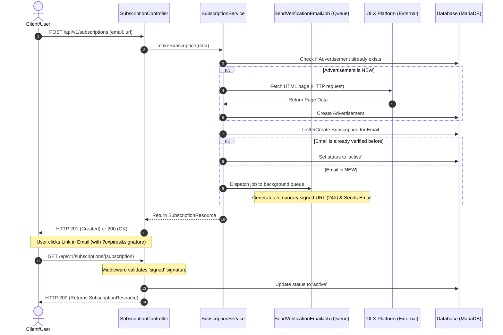

<div align="center">
    <h1>OLX Adverts</h1>
    <p>
        This service automates the monitoring of advertisement prices on the OLX platform. It allows users to subscribe to specific OLX
        listings via email and receive instant notifications whenever the price drops or changes.
    </p>
    
    
    
    
</div>

### Workflow Diagram (Sequence)



## How to start
```bash
git clone https://github.com/DenMitter/olx-adverts.git
cd olx-adverts
docker compose up -d
```

Open: http://localhost:8080/