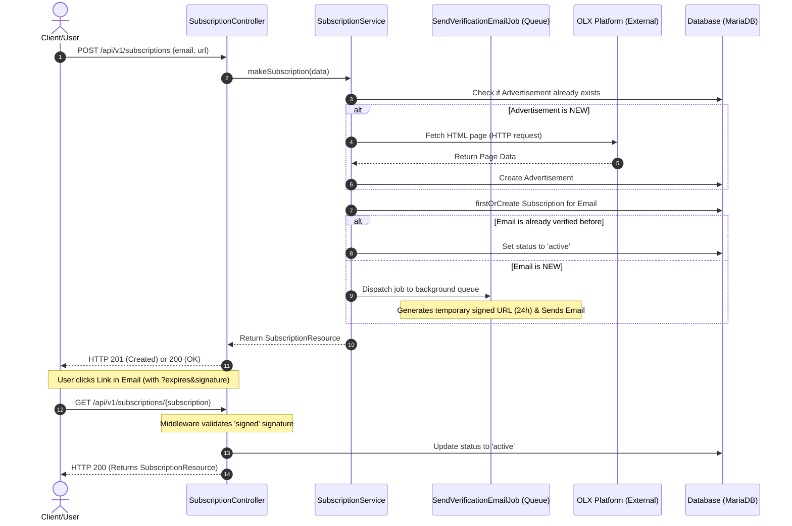

<div align="center">
    <h1>OLX Adverts</h1>
    <p>
        This service automates the monitoring of advertisement prices on the OLX platform. It allows users to subscribe to specific OLX
        listings via email and receive instant notifications whenever the price drops or changes.
    </p>
    
    
    
    
</div>

### Workflow Diagram (Sequence)



## How to start
```bash
git clone https://github.com/DenMitter/olx-adverts.git
cd olx-adverts
docker compose up -d
```

Open: http://localhost:8080/

## Architectural Decisions & Trade-offs

Here are the technical choices made in this project and the reasons why they were chosen.

---

### 1. Creating a Subscription: One POST Request vs Separate GET + POST
What should happen if a user subscribes to the same OLX link twice?

* **Approach A: Separate GET + POST**
  * **Pros:** Follows standard HTTP rules perfectly.
  * **Cons:** The frontend must make two requests (first check if it exists, then create).

* **Approach B: Idempotent POST (Chosen)**
  * **Pros:** Simple for the frontend. One URL handles everything.
  * **Cons:** It changes the traditional meaning of a POST request.

**Why chosen:** It makes the frontend integration easier. The client just sends the URL and email. The backend checks the database and returns 201 for a new subscription or 200 if it already exists.

---

### 2. Email Verification: Direct Sending vs Background Queue
How to send the confirmation email when a user subscribes?

* **Approach A: Direct Sending (Sync)**
  * **Pros:** Simple setup. No need to run a queue worker.
  * **Cons:** The user must wait 2-4 seconds for the page to load while the email is sending.

* **Approach B: Background Queue (Chosen)**
  * **Pros:** Fast API responses. The user does not wait.
  * **Cons:** Needs a queue worker running in the background.

**Why chosen:** Performance is important. The API responds instantly, and the email is sent in the background using a Laravel Job (SendVerificationEmailJob).

---

### 3. Data Extraction: Hybrid Approach (Scraping + Internal API)
How to get and update price data from OLX?

* **Approach A: Pure Web Scraping**
  * **Pros:** Gets all data (title, price, currency) from the public page.
  * **Cons:** Slow for background updates. Heavy HTML pages take more traffic and can get IP blocks.

* **Approach B: Hybrid Approach (Chosen)**
  * **Pros:** Fast and safe. Scraping is used only once at the start. Regular price checks use OLX internal API endpoints.
  * **Cons:** Needs two different data parsers in the backend service.

**Why chosen:** OLX does not have an open public API for private developers. To solve this, we use web scraping to create the subscription and get the title. Then, the background cron command uses OLX internal API endpoints to check prices quickly without loading heavy HTML pages.